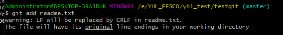

[TOC]


<font color=red>字体颜色</font>

# 一、GIT 是什么？

工作流程


- Workspace：工作区
- Index / Stage：暂存区
- Repository：仓库区（或本地仓库）
- Remote：远程仓库


# 二、在 Windows 上如何安装 Git？
在Windows上使用Git，可以从Git官网直接[下载安装程序](https://git-scm.com/downloads)，然后按默认选项安装即可。
安装完成后，在开始菜单里找到“Git”->“Git Bash”，蹦出一个类似命令行窗口的东西，就说明Git安装成功！


安装完成后，还需要最后一步设置，在命令行输入如下：

- `git config --global user.name "xxxx"`
- `git config --global user.email "xxxx@xxx.com"`


因为Git是分布式版本控制系统，所以需要填写用户名和邮箱作为一个标识。

> 注意：`git config --global` 参数，有了这个参数，表示你这台机器上所有的Git仓库都会使用这个配置，当然你也可以对某个仓库指定的不同的用户名和邮箱。


# 三、创建版本库

什么是版本库呢？版本库又名仓库，英文名 **repository**，你可以简单理解成一个目录，这个目录里面的所有文件都可以被Git管理起来，每个文件的修改、删除，Git都能跟踪，以便任何时刻都可以追踪历史，或者在将来某个时刻可以“还原”。


所以创建一个版本库也非常简单，如下我是D盘 --> YHL_FESCO  -->  yhl_test 目录下新建一个 testgit 版本库

- `mkdir xxx` 创建文件夹


- `pwd` 命令是用于显示当前的目录。

通过命令 `git init` 把这个目录变成git可以管理的仓库，如下：


这时候你当前testgit目录下会多了一个.git的目录，这个目录是Git来跟踪管理版本的，没事千万不要手动乱改这个目录里面的文件，否则，会把git仓库给破坏了。如下：


## demo 演示

### 常用操作口令

```
git add 文件名         把文件添加到仓库
git commit -m          把文件提交到仓库 -m后跟说明
git status			  查看仓库状态
git diff 文件名	 	查看修改的内容
```

下面先看下demo如下演示：

我在版本库 testgit 目录下新建一个记事本文件 readme.txt 内容如下：11111111

### 添加到暂存区

第一步：使用命令 `git add readme.txt` 添加到暂存区里面去。如下：

> 进入 vi 文本编辑，按 `a` 进入编辑模式，完成按 `Esc`，输入 `wq` 回车，保存退出。
>
> vi +文件名，新建一个文件并进入编辑状态（如果文件已存在，则直接进入编辑状态）
>
> 新建文件 使用 `touch 文件名` 
>
> 保存退出 `:wq`


如果和上面一样，没有任何提示，说明已经添加成功了。

### 提交到仓库

第二步：用命令 `git commit`告诉Git，把文件提交到仓库。


简单解释一下`git commit`命令，`-m` 后面输入的是本次提交的说明，可以输入任意内容，当然最好是有意义的，这样你就能从历史记录里方便地找到改动记录。

`git commit`命令执行成功后会告诉你，`1 file changed`：1个文件被改动（我们新添加的readme.txt文件）；`1 insertions`：插入了一行内容（readme.txt有一行内容）。

现在我们已经提交了一个 readme.txt 文件了，我们下面可以通过命令 `git status` 来查看是否还有文件未提交，如下：


说明没有任何文件未提交，但是我现在继续来改下 readme.txt 内容，比如我在下面添加一行2222222222 内容，继续使用 `git status` 来查看下结果，如下：


上面的命令告诉我们 readme.txt文件已被修改，但是未被提交的修改。


虽然Git告诉我们`readme.txt`被修改了，但如果能看看具体修改了什么内容，自然是很好的。比如你休假两周从国外回来，第一天上班时，已经记不清上次怎么修改的`readme.txt`，所以，需要用`git diff`这个命令看看：


把文件添加到版本库中。



同样没有任何输出。在执行第二步`git commit`之前，我们再运行`git status`看看当前仓库的状态：

```
$ git status
On branch master
Changes to be committed:
  (use "git restore --staged <file>..." to unstage)
        modified:   readme.txt
```

`git status`告诉我们，将要被提交的修改包括`readme.txt`，下一步，就可以放心地提交了：

```
git commit -m "文件增加 333333 内容"
```


### 版本回退

```
git log 		 查看日志
git log –-pretty=oneline    查看日志
git reset --hard 版本号	 穿梭版本
git reset --hard HEAD^	   回退上个版本
```


现在我已经对 readme.txt 文件做了三次修改了，那么我现在想查看下历史记录，如何查呢？我们现在可以使用命令 `git log` 演示如下所示：


git  log命令显示从最近到最远的显示日志，我们可以看到最近三次提交，最近的一次是，增加内容为333333。上一次是添加内容222222，第一次默认是 111111。如果嫌上面显示的信息太多的话，我们可以使用命令 `git log –pretty=oneline` 演示如下：


现在我想使用版本回退操作，我想把当前的版本回退到上一个版本，要使用什么命令呢？可以使用如下2种命令，

- 第一种是：`git reset --hard  HEAD^` 那么如果要回退到上上个版本只需把HEAD^ 改成 HEAD^^  以此类推。
- 那如果要回退到前100个版本的话，使用上面的方法肯定不方便，我们可以使用下面的简便命令操作：
  - `git reset --hard  HEAD~100` 即可。

如果想回退到上一个版本的命令如下操作：


再来查看下 readme.txt 内容如下：通过命令 `cat readme.txt` 查看


可以看到，内容已经回退到上一个版本了。我们可以继续使用 `git log` 来查看下历史记录信息，如下：


我们看到 增加 333333 内容我们没有看到了，但是现在我想回退到最新的版本，如：有333333 的内容要如何恢复呢？我们可以通过版本号回退，使用命令方法如下：

`git reset --hard 版本号` ，但是现在的问题假如我已经关掉过一次命令行或者333内容的版本号我并不知道呢？要如何知道增加3333内容的版本号呢？可以通过如下命令即可获取到版本号：`git reflog` 演示如下：


通过上面的显示我们可以知道，增加内容3333的版本号是 23b3e08 .我们现在可以命令

`git reset --hard 23b3e08` 来恢复了。演示如下：


可以看到 目前已经是最新的版本了。


## 理解工作区和暂存区的区别？

- 工作区：就是你在电脑上看到的目录，比如目录下 testgit 里的文件(.git隐藏目录版本库除外)。或者以后需要再新建的目录文件等等都属于工作区范畴。
- 版本库(Repository)：工作区有一个隐藏目录 .git，这个不属于工作区，这是版本库。其中版本库里面存了很多东西，其中最重要的就是stage(暂存区)，还有Git为我们自动创建了第一个分支 master ，以及指向master的一个指针HEAD。


我们前面说过使用Git提交文件到版本库有两步：

1. 是使用 `git add` 把文件添加进去，实际上就是把文件添加到暂存区。
2. 使用 `git commit` 提交更改，实际上就是把暂存区的所有内容提交到当前分支上。


# 四：Git撤销修改和删除文件操作

## 撤销修改

```
git checkout -- <file>
git restore --staged <file>    表示撤销暂存区的修改，将文件状态恢复到未 add 之前
git checkout -- <file>
```


比如我现在在readme.txt文件里面增加一行 内容为 555555555555，我们先通过命令查看如下：


在我未提交之前，我发现新添加的 内容有误，所以我得马上恢复以前的版本，现在我可以有如下几种方法可以做修改：

1. 如果我知道要删掉那些内容的话，直接手动更改去掉那些需要的文件，然后 add 添加到暂存区，最后 commit掉。
2. 我可以按以前的方法直接恢复到上一个版本。使用 `git reset --hard HEAD^`

但是现在我不想使用上面的2种方法，我想直接想使用撤销命令该如何操作呢？首先在做撤销之前，我们可以先用 `git status` 查看下当前的状态。如下所示：


可以使用 `git checkout -- file` 丢弃工作区的修改，如下命令：

`git checkout -- readme.txt` ，如下所示：  然后使用 `cat readme.txt` 查看


命令 `git checkout -- readme.txt` 意思就是，把 readme.txt 文件在工作区做的修改全部撤销，这里有2种情况，如下：

1. readme.txt自动修改后，还没有放到暂存区，使用 撤销修改就回到和版本库一模一样的状态。
2. 另外一种是readme.txt已经放入暂存区了，接着又作了修改，撤销修改就回到添加暂存区后的状态


> <font color=red>注意：命令 `git checkout -- readme.txt` 中的 -- 很重要，如果没有 -- 的话，那么命令变成创建分支了。</font>

文件已经 `git add` 到暂存区了，还没有 `git commit` ，用 `git status`查看一下，修改只是添加到了暂存区。使用 `git restore --staged a.txt` 可以回退版本到工作区。如果想丢弃工作区的修改，执行 `git checkout -- <file>` 。完成！


## 删除文件

```
rm 文件名   					删除文件
git checkout -- 文件名			 恢复文件
```


假如我现在版本库testgit目录添加一个文件b.txt,然后提交。如下：


如上：一般情况下，可以直接在文件目录中把文件删了，或者使用如上 rm 命令：`rm b.txt` ，如果我想彻底从版本库中删掉了此文件的话，可以再执行 commit 命令 提交掉，现在目录是这样的，


只要没有commit之前，如果我想在版本库中恢复此文件如何操作呢？

可以使用如下命令 `git checkout -- a.txt`，如下所示：


# 五、远程仓库

在了解之前，先注册github账号，由于你的本地Git仓库和github仓库之间的传输是通过SSH加密的，所以需要一点设置：

第一步：创建SSH Key。在用户主目录下，看看有没有.ssh目录，如果有，再看看这个目录下有没有id_rsa和id_rsa.pub这两个文件，如果有的话，直接跳过此如下命令，如果没有的话，打开Shell（Windows下打开Git Bash），创建SSH Key：

```
ssh-keygen -t rsa –C “youremail@example.com”
```

你需要把邮件地址换成你自己的邮件地址，然后一路回车，使用默认值即可，由于这个Key也不是用于军事目的，所以也无需设置密码。

如果一切顺利的话，可以在用户主目录 `C:\Users\Administrator\` 里找到`.ssh`目录，里面有`id_rsa`和`id_rsa.pub`两个文件，这两个就是SSH Key的秘钥对，`id_rsa`是私钥，不能泄露出去，`id_rsa.pub`是公钥，可以放心地告诉任何人。


第二步：登陆GitHub，打开“Account settings”，“SSH Keys”页面：

然后，点“Add SSH Key”，填上任意Title，在Key文本框里粘贴`id_rsa.pub`文件的内容：


点 `“Add Key”`，你就应该看到已经添加的Key：


为什么GitHub需要SSH Key呢？因为GitHub需要识别出你推送的提交确实是你推送的，而不是别人冒充的，而Git支持SSH协议，所以，GitHub只要知道了你的公钥，就可以确认只有你自己才能推送。

当然，GitHub允许你添加多个Key。假定你有若干电脑，你一会儿在公司提交，一会儿在家里提交，只要把每台电脑的Key都添加到GitHub，就可以在每台电脑上往GitHub推送了。

最后友情提示，在GitHub上免费托管的Git仓库，任何人都可以看到喔（但只有你自己才能改）。所以，不要把敏感信息放进去。


## 如何添加远程库？

现在的情景是，你已经在本地创建了一个Git仓库后，又想在GitHub创建一个Git仓库，并且让这两个仓库进行远程同步，这样，GitHub上的仓库既可以作为备份，又可以让其他人通过该仓库来协作，真是一举多得。

首先，登陆GitHub，然后，在右上角找到 `“new repository”` 按钮，创建一个新的仓库：


在Repository name填入`learngit`，其他保持默认设置，点击 `“Create repository”` 按钮，就成功地创建了一个新的Git仓库：


目前，在GitHub上的这个`learngit`仓库还是空的，GitHub告诉我们，可以从这个仓库克隆出新的仓库，也可以把一个已有的本地仓库与之关联，然后，把本地仓库的内容推送到GitHub仓库。

现在，我们根据GitHub的提示，在本地的`learngit`仓库下运行命令：

```
git remote add origin https://github.com/testeryu-ing/learngit.git				# 关联本地和github仓库
```

请千万注意，把上面的`testeryu-ing`替换成你自己的GitHub账户名，否则，你在本地关联的就是我的远程库，关联没有问题，但是你以后推送是推不上去的，因为你的SSH Key公钥不在我的账户列表中。

添加后，远程库的名字就是`origin`，这是Git默认的叫法，也可以改成别的，但是`origin`这个名字一看就知道是远程库。

下一步，就可以把本地库的所有内容推送到远程库上：

```
$ git push -u origin master
Enumerating objects: 26, done.
Counting objects: 100% (26/26), done.
Delta compression using up to 4 threads
Compressing objects: 100% (13/13), done.
Writing objects: 100% (26/26), 2.12 KiB | 94.00 KiB/s, done.
Total 26 (delta 1), reused 0 (delta 0), pack-reused 0
remote: Resolving deltas: 100% (1/1), done.
To https://github.com/testeryu-ing/learngit.git
 * [new branch]      master -> master
Branch 'master' set up to track remote branch 'master' from 'origin'.
```

把本地库的内容推送到远程，用`git push`命令，实际上是把当前分支`master`推送到远程。

由于远程库是空的，我们第一次推送`master`分支时，加上了`-u`参数，Git不但会把本地的`master`分支内容推送的远程新的`master`分支，还会把本地的`master`分支和远程的`master`分支关联起来，在以后的推送或者拉取时就可以简化命令。

推送成功后，可以立刻在GitHub页面中看到远程库的内容已经和本地一模一样：


从现在起，只要本地作了提交，就可以通过命令：

```
$ git push origin master
```

把本地 `master` 分支的最新修改推送至GitHub，现在，你就拥有了真正的分布式版本库！


